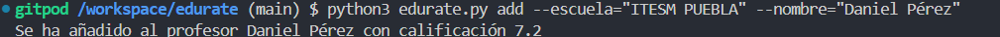
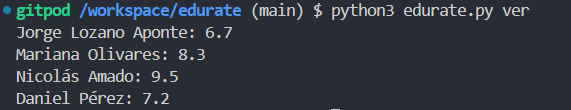

# edurate
CLI/API que te permite ver los ratings de profesores en misprofesores.com

## Cómo utilizar
Por el momento solo Ubuntu es soportado. Además, es necesario contar con Python 3.11 y Chrome instalados.
Para iniciar la API base de Edurate, es necesario ejecutar el servidor de uvicorn con una terminal aparte con screen en el host 0.0.0.0 y el puerto 8000. Si no desea utilizar este puerto, es fácilmente modificable en la CLI que se encuentra en edurate.py.
Después, edurate funcionará utilizando Fire CLI para añadir a los profesores y para observar su calificación.

Además, podrá observar las calificaciones de todos sus profesores actuales:

## API
La CLI funciona mediante una API local y una db local. La API fue creada con FastAPI y la DB fue creada con SQLite. Los datos acerca de los profesores son recuperados mediante Selenium hacia el sitio web oficial de misprofesores.com. De esta forma, el usuario tiene una historia de los profesores con los que cursa y además podrá remover y añadir más profesores cuando lo necesite.